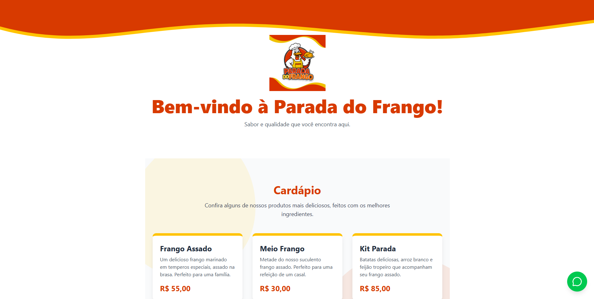

# Website - Parada do Frango

Este é o repositório oficial do website institucional para o restaurante **Parada do Frango**. O projeto foi desenvolvido com tecnologias modernas de front-end para criar uma experiência de usuário rápida, responsiva e visualmente agradável, seguindo a identidade visual da marca.

---

## ✨ Funcionalidades

- **Design Responsivo:** Interface totalmente adaptável para desktops, tablets e dispositivos móveis.
- **Página Inicial Completa:** Apresenta as seções principais do negócio:
    - **Header:** Cabeçalho com identidade visual forte, usando ondas SVG.
    - **Cardápio Resumido:** Exibe os principais produtos para atrair o cliente.
    - **Localização:** Seção com informações de endereço, telefone, horário e um mapa interativo do Google Maps.
    - **Footer:** Rodapé com informações de copyright e design consistente.
- **Página de Cardápio Completo:** Uma rota dedicada (`/cardapio`) com todas as categorias e itens do menu, otimizada para SEO e fácil compartilhamento.
- **Roteamento SPA:** Navegação fluida entre páginas usando `react-router-dom`, sem a necessidade de recarregar a página.
- **Tratamento de Erros:**
    - **Página 404:** Uma página dedicada para rotas não encontradas.
    - **Error Boundary:** Um mecanismo que captura erros de runtime, evitando que a aplicação quebre e exibindo uma mensagem amigável.
- **Botão Flutuante:** Um botão de contato via WhatsApp sempre visível para facilitar os pedidos.

---

## 🛠️ Tecnologias Utilizadas

Este projeto foi construído utilizando as seguintes tecnologias:

- **[React](https://reactjs.org/):** Biblioteca principal para a construção da interface de usuário.
- **[Vite](https://vitejs.dev/):** Ferramenta de build para um desenvolvimento rápido e otimizado.
- **[Tailwind CSS](https://tailwindcss.com/):** Framework CSS utility-first para estilização rápida e consistente.
- **[React Router DOM](https://reactrouter.com/):** Para gerenciamento de rotas e navegação.
- **[Lucide React](https://lucide.dev/):** Biblioteca de ícones SVG leve e customizável.

---

## 🚀 Deploy

Url para acessar o site: https://paradadofrango.store